# CI/CD Pipeline with Maven and Jenkins (End-to-End)

> **Project Goal:** Automate the build process of a Java-based registration app using Maven and Jenkins, with GitHub for source control and an Ubuntu server for hosting Jenkins.

---

## 🛠️ Tools & Technologies

- **Jenkins** – CI/CD automation server
- **Maven** – Java build and dependency management tool
- **Git & GitHub** – Version control and source code repository
- **Ubuntu EC2** – Server environment
- **Java 21** – Runtime and compilation environment

---

## 📈 Architecture Flow

1. Developer pushes code to GitHub.
2. Jenkins pulls code from GitHub.
3. Maven compiles and builds the application.
4. Jenkins stores the artifact in a target directory.

---

## ⚙️ Setup Instructions

### 🔹 1. Provision Ubuntu Server (EC2)

```bash
# Set a password for the default Ubuntu user
sudo passwd ubuntu

# Enable password authentication
cd /etc/ssh
sudo vi sshd_config
# Uncomment: PasswordAuthentication yes

# Restart SSH daemon
sudo systemctl restart sshd /
systemctl daemon-reload
```

### 🔹 2. Update and Install Java 21

```bash
sudo apt update && sudo apt upgrade -y
sudo apt install openjdk-21-jdk -y

# Check Java path
readlink -f $(which java)

# Set JAVA_HOME
cd
vi .profile
# Add below lines to the end:
export JAVA_HOME="/usr/lib/jvm/java-21-openjdk-amd64"
export PATH="$PATH:$JAVA_HOME/bin"

# Apply changes
source .profile
```

### 🔹 3. Install Maven

```bash
# Download Maven
sudo wget https://dlcdn.apache.org/maven/maven-3/3.9.9/binaries/apache-maven-3.9.9-bin.zip

# Install unzip
sudo apt install unzip -y

# Unzip Maven
sudo unzip apache-maven-3.9.9-bin.zip -d /opt

# Clean up
sudo rm apache-maven-3.9.9-bin.zip

# Set environment variables
vi ~/.profile
# Add:
export MAVEN_HOME="/opt/apache-maven-3.9.9"
export M2_HOME="/opt/apache-maven-3.9.9"
export PATH="$PATH:$MAVEN_HOME/bin:$M2_HOME/bin"

# Apply changes
source ~/.profile

# Check version
mvn --version
```

---

## 🧪 Git & GitHub Commands Used

```bash
# Set identity
git config --global user.name "<your-name>"
git config --global user.email "<your-email>"

# Git basics
git add .
git commit -m "message"
git push

git status

# Branching
git branch sprint1
git checkout sprint1
git switch sprint1

git merge sprint1

git push --all origin

git remote add origin <repo-url>
git push --set-upstream origin main

git checkout -b fixit1
git diff
git revert HEAD
git reset --hard <commit-id>
```

---

## ⚙️ Jenkins Installation via Script

```bash
# Create jenkins.sh file
vi jenkins.sh

# Add the following:
#!/bin/bash
sudo wget -O /usr/share/keyrings/jenkins-keyring.asc \
  https://pkg.jenkins.io/debian-stable/jenkins.io-2023.key

echo "deb [signed-by=/usr/share/keyrings/jenkins-keyring.asc] \
  https://pkg.jenkins.io/debian-stable binary/" | sudo tee \
  /etc/apt/sources.list.d/jenkins.list > /dev/null

sudo apt-get update -y
sudo apt-get install jenkins -y

# Make script executable
chmod u+x jenkins.sh

# Run the script
bash jenkins.sh
```

### Open Jenkins

```bash
# Ensure Jenkins is running
sudo systemctl status jenkins

# Check port
sudo netstat -tnlp | grep :8080

# Get server IP
ifconfig

# Access: http://<server-ip>:8080

# Retrieve admin password
sudo cat /var/lib/jenkins/secrets/initialAdminPassword
```

### Jenkins UI Setup

- Install suggested plugins
- Configure JDK: Add JAVA_HOME `/usr/lib/jvm/java-21-openjdk-amd64`
- Configure Maven: Add MAVEN_HOME `/opt/apache-maven-3.9.9`

---

## 🚀 CI/CD Pipeline Configuration in Jenkins

### Create Freestyle Project

- Name: `Project_Henry`
- Source Code Management: Git → `https://github.com/olat95/registration-app-devops.git`
- Build Trigger: (Optional) GitHub webhook
- Build Step: `Invoke top-level Maven targets`
  - Maven Version: `MAVEN_HOME`
  - Goals: `test install`

### Execute Build

- Click **Build Now**
- Jenkins pulls source → runs Maven → stores artifact in `target/`

#### 📸 Screenshots

1. **Git Repository Configuration in Jenkins**  
   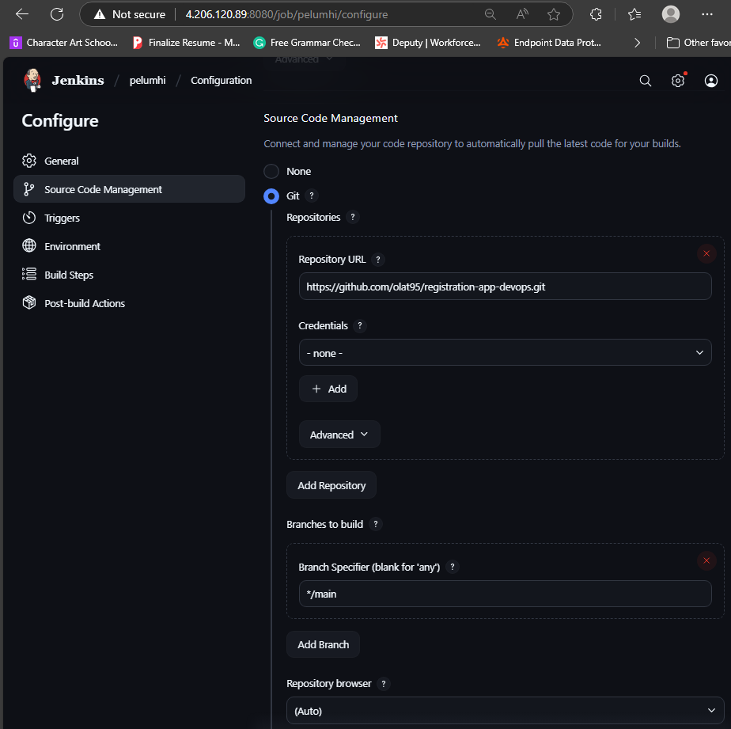

2. **Build Step with Maven Target**  
   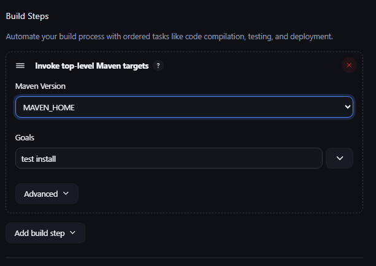

3. **Successful Jenkins Build**  
   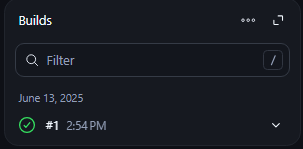

---

## 🧠 Reflections & Learnings

- Understood how to automate Java project builds with Maven.
- Gained hands-on with Git commands for local/remote branch management.
- Learned how to configure and automate Jenkins with custom build steps.
- Understood the interaction between Jenkins, GitHub, and Maven.

---

## 📎 Resources

- [Apache Maven](https://maven.apache.org/)
- [Jenkins Official Docs](https://www.jenkins.io/doc/)
- [Git Documentation](https://git-scm.com/doc)

---

> 🧠 **Week 1 Complete!** Stay tuned for the next project in this DevOps journey.

--======--

# Week 2: CI/CD Deployment to Apache Tomcat via Jenkins (with SSH & Docker Setup)

> **Project Goal:** Deploy a Java web application to a Tomcat staging server using Jenkins post-build automation over SSH. Set up Docker for future containerized deployments.

---

## 🛠️ Tools & Technologies

- **Jenkins** – Automates CI/CD process
- **Apache Tomcat** – Hosts Java web app in staging
- **SSH** – Secure file transfer between VMs
- **Docker** – Containerization setup
- **Java 21**, **Ubuntu**, **Maven**, **Git**, **GitHub**

---

## 📈 Architecture Overview

1. Developer pushes code to GitHub.
2. Jenkins (on the workstation server) pulls the source code.
3. Jenkins uses Maven to build the project and generate a `.war` file.
4. Jenkins transfers the `.war` file via SSH to the Tomcat webapps directory on the staging server.
5. Jenkins triggers Tomcat to deploy the application.

---

## 🔧 Setup & Configuration

### 1. ✅ Create Two Ubuntu VMs

We began by creating two separate Ubuntu VMs:

- **Workstation VM**: For Jenkins, Git, Maven, and Java.
- **Staging VM**: For Tomcat and Docker (future container hosting).

This separation allows us to simulate a more realistic DevOps setup.

---

### 2. ☕ Installing Apache Tomcat on the Staging Server

We logged into the staging VM and installed Java 21. Then, to prepare a runtime environment for our `.war` artifact, we installed Tomcat:

```bash
cd /opt
sudo wget https://dlcdn.apache.org/tomcat/tomcat-10/v10.1.42/bin/apache-tomcat-10.1.42.tar.gz
sudo tar -xvf apache-tomcat-10.1.42.tar.gz
sudo rm apache-tomcat-10.1.42.tar.gz
sudo chown -R ubuntu:ubuntu apache-tomcat-10.1.42/
```

Next, we configured environment variables for Tomcat:

```bash
vi ~/.profile
```

Append:

```bash
export JAVA_HOME=/usr/lib/jvm/java-11-openjdk-amd64
export CATALINA_HOME=/opt/apache-tomcat-10.1.42
export CATALINA_BASE=/opt/apache-tomcat-10.1.42
export PATH=${PATH}:${JAVA_HOME}/bin:${CATALINA_HOME}/bin:${CATALINA_BASE}/bin
```

Apply changes:

```bash
source ~/.profile
```

Then navigate into the `webapps` directory where our `.war` artifact will live:

```bash
cd /opt/apache-tomcat-10.1.42/webapps
```

---

### 3. 🔐 Setting Up Passwordless SSH Between Servers

We needed Jenkins on the workstation server to securely access the staging server via SSH. SSH is user-to-user, so we needed to set this up manually.

On **Workstation VM** (as `jenkins`):

```bash
sudo passwd jenkins
su jenkins
cd ~
mkdir -p .ssh && cd .ssh
ssh-keygen -t rsa
cat id_rsa.pub
```

On **Staging VM**:

```bash
cd ~/.ssh
vi authorized_keys  # Paste the public key
```

Test connection:

```bash
ssh ubuntu@<staging-server-ip>
```

---

### 4. ⚙️ Jenkins Configuration for SSH Transfer

In Jenkins:

- Navigate to **Manage Jenkins > Configure System > SSH Servers**
- Add new SSH server:
  - **Name:** Mo-staging
  - **Hostname:** `<staging-server-ip>`
  - **Username:** `ubuntu`
  - **Remote Directory:** `.`
  - **Path to private key:** `/var/lib/jenkins/.ssh/id_rsa`

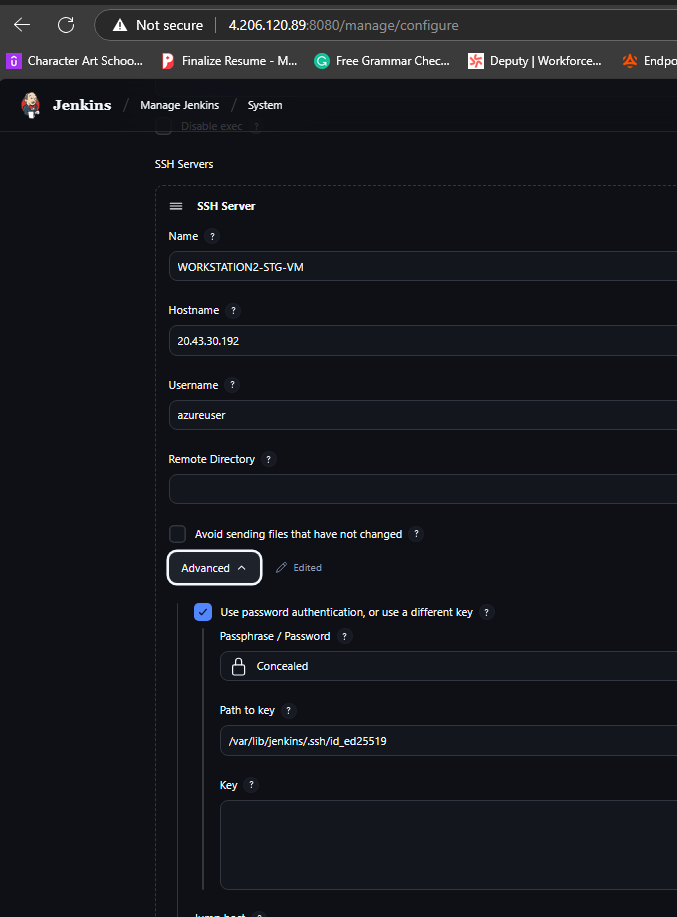

Test configuration → Save.

In Jenkins:

- Navigate to **Manage Jenkins > Configure System > SSH Servers**
- Add new SSH server:
  - **Name:** Mo-staging
  - **Hostname:** `<staging-server-ip>`
  - **Username:** `ubuntu`
  - **Remote Directory:** `.`
  - **Path to private key:** `/var/lib/jenkins/.ssh/id_rsa`

Test configuration → Save.

---

### 5. 🚀 Jenkins Post-Build Artifact Transfer

Inside Jenkins Job:

- Go to **Configure > Post-build Actions > Send build artifacts over SSH**

Settings:

- **Source files:** `webapp/target/webapp.war`
- **Remove prefix:** `webapp/target`
- **Remote directory:** `.`
- **Exec command:**

```bash
sudo cp ./webapp.war /opt/apache-tomcat-10.1.42/webapps
```


Inside Jenkins Job:

- Go to **Configure > Post-build Actions > Send build artifacts over SSH**

Settings:

- **Source files:** `webapp/target/webapp.war`
- **Remove prefix:** `webapp/target`
- **Remote directory:** `.`
- \**Exec command:*sudo cp ./webapp.war /opt/apache-tomcat-10.1.42/webapps\*

```bash
sudo cp ./webapp.war /opt/apache-tomcat-10.1.42/webapps
```

---

### 6. 🐳 Docker Installation on the Staging Server

To prepare for future containerized deployments:

```bash
sudo apt install docker.io -y
sudo usermod -aG docker ubuntu
getent group | grep docker
sudo init 6
```

After reboot:

```bash
docker ps
```

---

### 7. 🧪 Final Pipeline Test & Troubleshooting


To test our setup:

To test our setup:

1. Remove any previously deployed artifacts:

```bash
rm /opt/apache-tomcat-10.1.42/webapps/webapp.war
```

2. Trigger build in Jenkins.
3. Verify automatic deployment via Tomcat:

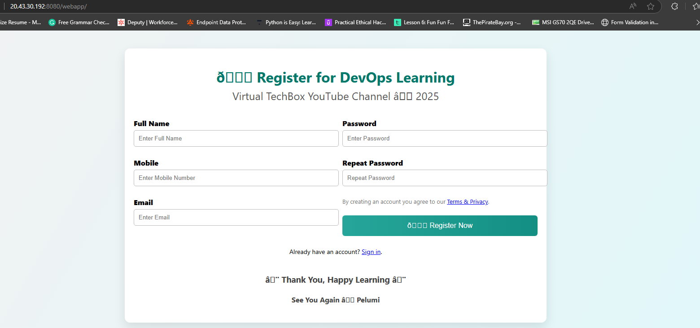

```bash
http://<staging-ip>:8080/webapp/
```

During this step, I encountered a common blocker: the Jenkins build was marked "unstable" due to a failed SSH transfer. On troubleshooting, I realized port 22 was not open. Once I added the correct NSG rule to allow SSH on both VMs, the pipeline completed successfully.

---

## 🧠 Reflections & Learnings

This project was both challenging and fulfilling. It involved many moving parts — and I hit roadblocks. The biggest lesson came from a failed build. In the past, I might’ve given up. But this time, I dug deeper. I discovered that Jenkins-to-staging SSH failed because port 22 wasn’t enabled. Once fixed, everything worked seamlessly.

🔑 Key takeaways:

- Jenkins post-build SSH is powerful when done right
- Port 22 must be open for SSH transfers
- Manual Tomcat deployment is foundational before Docker
- Passwordless SSH setups are critical for automation
- This time, I saw it through — and completed the project successfully

---

✅ **Week 2 Complete!**
We now deploy `.war` files automatically to Tomcat from Jenkins. Docker is installed and ready for container-based deployments in Week 3!

--======--

# Week 3: Containerization & Dockerized Deployment via Jenkins

> **Project Goal:** Package the Java web application into a Docker container and automate its deployment via Jenkins post-build actions. This step introduces containerization to make our deployments portable, lightweight, and environment-independent.

---

## 🛠️ Tools & Technologies

- **Docker** – Containerization platform
- **Jenkins** – Automates CI/CD process
- **Tomcat (in container)** – Hosts Java web app
- **Ubuntu**, **Java**, **Maven**, **Git**, **GitHub**

---

## 📈 Architecture Overview

1. Code is pushed to GitHub.
2. Jenkins builds the `.war` file using Maven.
3. A Docker container is created using a custom Dockerfile.
4. Jenkins automates the Docker build and container run.
5. The app becomes accessible on specified container ports.

---

## 🔧 Setup & Configuration

### 1. ⚙️ Docker Installation on Target Servers

Install Docker on both **staging** and **QA servers**:

```bash
sudo apt update -y && sudo apt upgrade -y
sudo apt install docker.io -y
sudo systemctl start docker
sudo systemctl enable docker
```

Confirm Docker version:

```bash
docker --version
```

Add current user to the Docker group for permission:

```bash
sudo usermod -aG docker ${USER}  # ${USER} resolves to 'azureuser'
sudo init 6  # Reboot the machine
```

---

### 2. 🧪 Test Pulling & Running Containers

We tested Docker image pulls from DockerHub:

```bash
docker pull tomcat:latest
docker pull nginx:latest
docker pull httpd:latest
docker images  # List downloaded images
```

Run a container exposing Tomcat:

```bash
docker run -d --name artford-con -p 8080:8080 tomcat:latest
```

Validate port availability:

```bash
sudo apt install net-tools -y
sudo netstat -tnlp | grep :8080
```


---

### 3. 🔁 Manage Containers and Images

Stop, remove containers, and clean up:

```bash
docker stop artford-con
docker rm artford-con
docker ps -a
```

Remove images:

```bash
docker rmi <image-id>
```

Run multiple containers on different ports:

```bash
docker run -d --name henry-con -p 8085:8080 tomcat:latest
docker run -d --name bliss-con -p 8090:8080 tomcat:latest
docker run -d --name dann-con -p 8095:8080 tomcat:latest
```

---

### 4. 📦 Deploying Artifact Inside Containers

Access the container shell:

```bash
docker exec -it henry-con /bin/bash
```

Inside the container:

```bash
cd /usr/local/tomcat/webapps  # Destination for .war file
cp -r /usr/local/tomcat/webapps.dist/* /usr/local/tomcat/webapps
```

From host machine:

```bash
docker cp webapp.war henry-con:/usr/local/tomcat/webapps
```

Check browser:

```url
http://<server-ip>:8085/webapp/
```

---

### 5. 🛠️ Dockerfile for Custom Image Creation

We automated container provisioning by writing a Dockerfile:

```dockerfile
FROM tomcat:latest
COPY ./webapp.war /usr/local/tomcat/webapps
RUN cp -r /usr/local/tomcat/webapps.dist/* /usr/local/tomcat/webapps
```

Build and run custom image:

```bash
docker build -t bliss-im .
docker run -d --name bliss-con -p 8090:8080 bliss-im
```

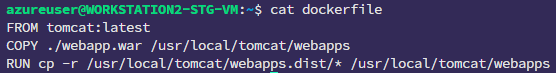

---

### 6. 🔁 Jenkins Post-Build Docker Deployment

Inside Jenkins Job:

**Dashboard > Project Name > Configure > Post-build Actions > Exec Command**

Add:

```bash
sudo docker build -t austin-im .
sudo docker run -d --name austin-con -p 8088:8080 austin-im
```

Click **Build Now** to automate:

- Docker image build from Dockerfile
- Container launch on port 8088

💡 Common Error: Jenkins may show unstable build due to namespace issues.

Clean up and rebuild:

```bash
docker stop austin-con
docker rm austin-con
docker rmi austin-im
sudo docker build -t austin-im .
sudo docker run -d --name austin-con -p 8088:8080 austin-im
```

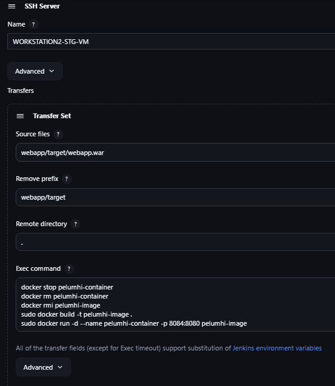

---

## 🧠 Reflections & Learnings

Containerizing the app took us one step closer to cloud-native DevOps. It was refreshing to see how quickly containers spin up and deploy artifacts without worrying about host environments.

🔑 Key Takeaways:

- Docker simplifies and standardizes deployments
- Jenkins post-build automation saves time
- Dockerfiles eliminate manual container configuration
- Jenkins has namespace limits — for more complex flows, consider using Ansible or custom scripts

---

✅ **Week 3 Complete!**
We’ve automated deployments inside Docker containers directly from Jenkins. Next up: pushing custom Docker images to DockerHub and pulling them into K8s clusters!

---

# Week 4: Ansible-Powered Production Deployment via Docker & Jenkins

> **Project Goal:** Deploy containerized applications to multiple production servers using Ansible automation from a staging (QA) server. DockerHub is used as the image registry, with Ansible and Jenkins orchestrating the deployment pipeline.

---

## 🛠️ Tools & Technologies

- **Ansible** – Automated deployments via SSH
- **Docker** – Containerization engine
- **Jenkins** – Continuous deployment trigger
- **DockerHub** – Public container registry
- **Amazon EC2 / Azure VMs** – Target production servers

---

## 📈 Architecture Overview

1. Developers push code to GitHub.
2. Jenkins builds the application and creates a `.war` artifact.
3. Docker image is built and container tested on staging.
4. Image is pushed to DockerHub.
5. Ansible playbook runs from QA server to production VMs over SSH.
6. Production servers pull the image and run containers.

---

## 🐳 Docker Image Push to DockerHub

Once satisfied with the container in QA (e.g. `austin-con`), we commit it into an image and push to DockerHub.

```bash
$ docker ps -a                              # View containers
$ docker start pelumhi-container           # Start container to commit
$ docker login -u <dockerhub-username>     # Authenticate with DockerHub
$ docker commit <container-id> <dockerhub-username/repo-name:tagname>  # Commit container as image
$ docker images                            # Confirm image creation
$ docker push <dockerhub-username/repo-name:tagname>  # Push to DockerHub
```

> 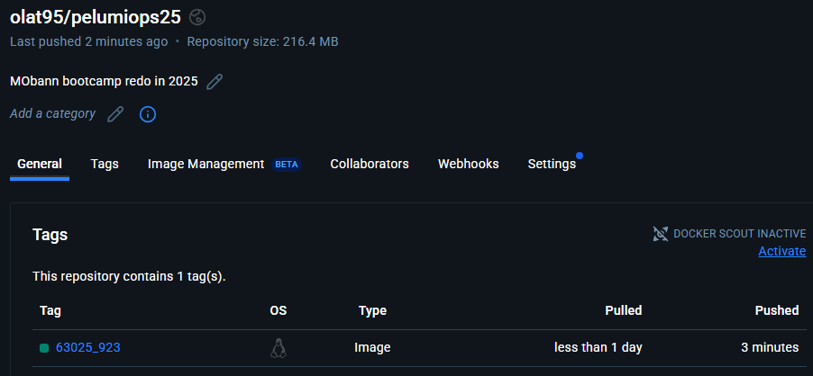

---

## ⚙️ Ansible Setup on Staging Server

```bash
$ sudo apt update && sudo apt upgrade -y                              # Update OS
$ sudo apt install ansible -y                                         # Install Ansible
$ sudo apt install python3-pip -y                                     # Python for pip
$ pip install --break-system-packages docker                          # Install Docker SDK for Ansible
$ ansible --version                                                   # Confirm installation
```

---

## 📄 Ansible Inventory & Playbook

### `hosts` (inventory):

```ini
# List of Production Servers
azureuser@4.204.67.84
azureuser@4.206.93.101
```

### `pelumhi-app.yaml`:

```yaml
---
- hosts: all
  tasks:
    - name: copy dockerfile into Remote machine
      copy:
        src: dockerfile
        dest: .

    - name: copy .war file into Remote machine
      copy:
        src: webapp.war
        dest: .

    - name: stop the running container
      command: docker stop pelumhi-container
      ignore_errors: True

    - name: remove the running container
      command: docker rm pelumhi-container
      ignore_errors: True

    - name: remove the running image
      command: docker rmi pelumhi-image
      ignore_errors: True

    - name: create customimage from dockerfile
      command: docker build -t pelumhi-image .

    - name: create and run container
      command: docker run -d --name pelumhi-container -p 8081:8080 pelumhi-image
```

> 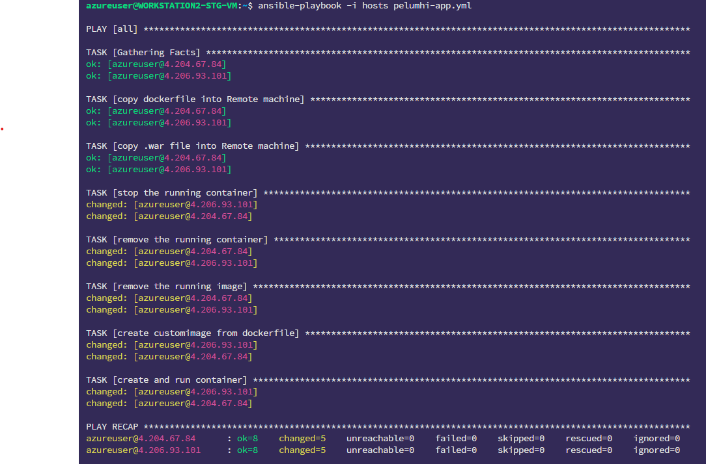

Run the playbook:

```bash
$ ansible-playbook -i hosts pelumhi-app.yaml
```

---

## 🔁 Jenkins Integration with Ansible

### Jenkins → Post-Build Exec Command:

```bash
ansible-playbook -i hosts pelumhi-app.yaml
```

> Navigate to Jenkins Job → Configure → Add as Exec Command.

> 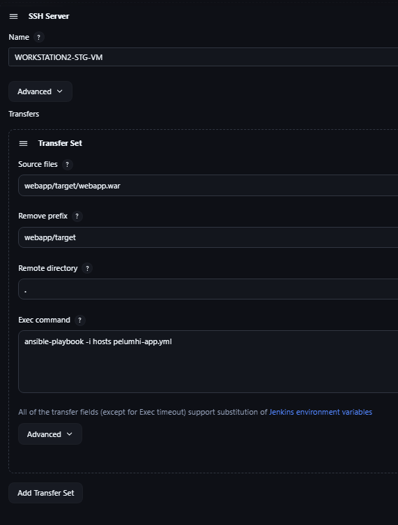

---

## 🔄 Jenkins Build Trigger & Webhook Setup

We set up a Jenkins build trigger so every time a developer pushes code to GitHub, Jenkins pulls and triggers the full deployment.

1. Navigate to Jenkins Job → **Configure > Build Triggers**
2. Check "GitHub hook trigger for GITScm polling"
3. Ensure GitHub webhook is added to trigger Jenkins build

> 💡 Screenshot suggestion: Jenkins build trigger config → `assets/jenkins-webhook.png`

---

## 🧠 Reflections & Learnings

This week, I achieved automated multi-server deployment using Ansible.

🔑 Key Takeaways:

- Docker image pushes decouple deployment from infrastructure
- Ansible playbooks scale deployment across any number of VMs
- Jenkins can act as the bridge between build and deployment with just one exec command
- Manual provisioning is error-prone — automation boosts repeatability and confidence

---

✅ **Week 4 Complete!**

- DockerHub connected
- Ansible deployed across production
- Jenkins now fully controls deployment via build triggers

> 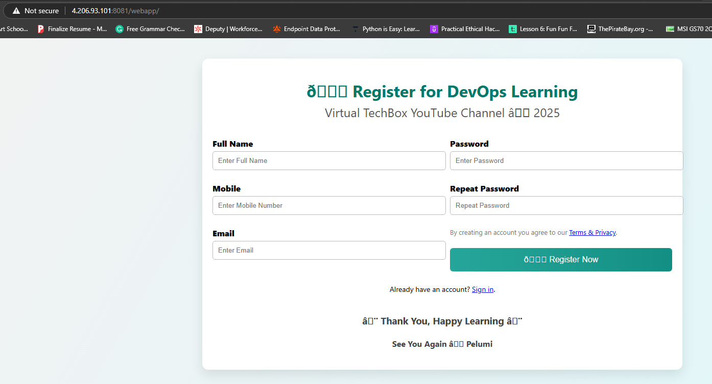 > 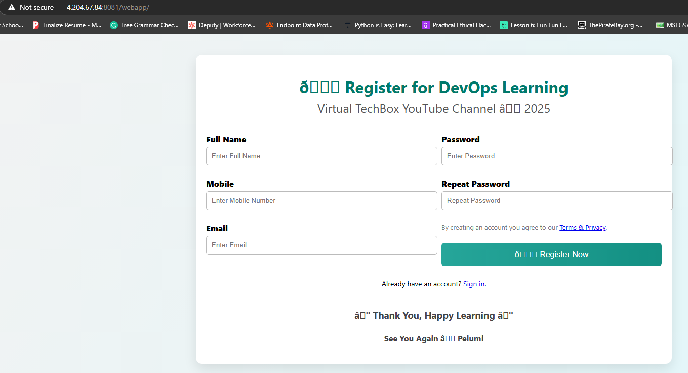
